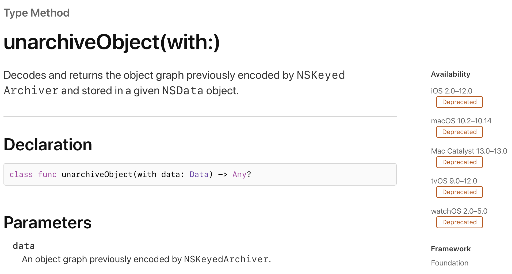
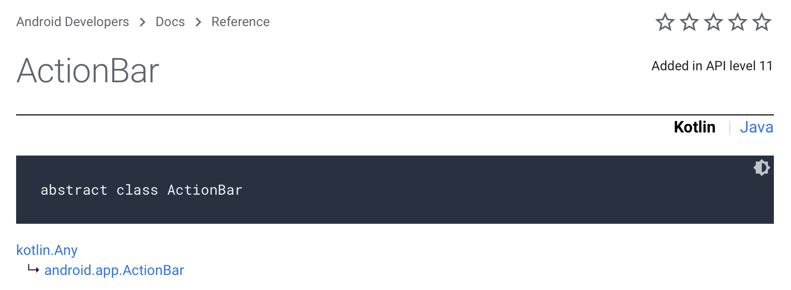
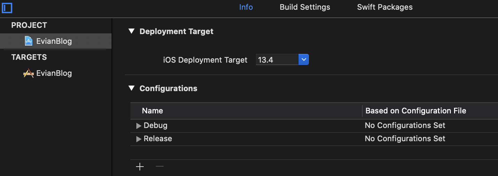
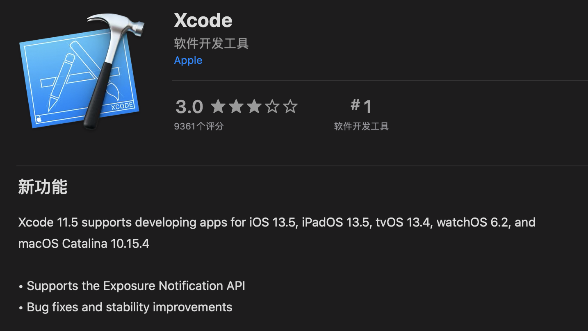

本系列文章以我的个人博客的搭建为线索（GitHub 仓库：[Evian-Zhang/evian-blog](https://github.com/Evian-Zhang/evian-blog)），记录我在现代化程序设计中的一些笔记。在这篇文章中，我将介绍的是iOS和Android原生应用开发中所需要的套件。

# 应用开发模式

首先，我们要搞清楚，开发一个原生应用，究竟是一个怎样的模式。直白地说，就是：

1. 操作系统提供者将新系统的API和动态链接库打包成SDK发放给开发者
2. 开发者使用SDK开发应用
3. 开发者将应用投放到新系统中供用户使用

这三步说起来很简单，但是在实际生产过程中，有许许多多的开发套件以及需要注意的细节。其中，一个套件的版本究竟会不会冲突，是很麻烦的事，也是我会在这篇文章中着重介绍的。

为了便于理解，我们可以把开发一个应用比作训练一名厨师。操作系统提供者就相当于提供了一个厨房，并且告诉我们了有哪些可以直接用的食材，我们根据这些食材告诉厨师应该怎么做成料理，然后把厨师送到相应的厨房即可。

# 开发语言

应用开发的第一步，就是开发语言了。iOS和Android都经历过一次开发语言的更新，iOS从Objective-C更新到了Swift，Android从Java更新到了Kotlin。

开发语言就相当于我们怎么教厨师做菜，我们可以用英语教，也可以用汉语教。

在iOS中，由于代码都是直接编译成二进制代码，所以编程语言的版本和我们实际开发没有什么大的关系，况且Swift的ABI也已经稳定了，所以我们在开发的时候也不用太过担心语言不匹配的问题（最新版Xcode会自带最新版的Swift）。

在Android中，代码是编译成JVM字节码的（然后在安装或运行时被编译成dex字节码在[ART](https://source.android.google.cn/devices/tech/dalvik)上运行），这就会产生一些问题。我们可以在[这篇指南](https://developer.android.google.cn/studio/write/java8-support)中看到，Android支持所有的Java 7特性，但是依据平台不同，只支持部分的Java 8特性。而Kotlin则更省心一点，我们从[这个FAQ](https://developer.android.google.cn/studio/write/java8-support)中可以看到，Kotlin默认编译成兼容Java 6特性的JVM字节码，所以在所有Android平台上都可以运行，从而我们使用Kotlin的时候，也不需要关注开发语言的版本。

# SDK

SDK就是我们开发者与操作系统提供者最主要的联系了，我们写应用必然会调用到系统提供的API。

SDK就相当于厨房提供者提供的食材、厨具，厨房提供者可能会帮我们去外面采购食材，但这些都不需要我们知道，我们只需要知道这个厨房提供了哪些食材，以及怎么使用这些食材。操作系统的一个版本就相当于一个厨房，每次更新操作系统版本，我们就相当于进了一个新的厨房。厨房的提供者每次开新厨房的时候，都会告诉你，我们这个新厨房，和旧食堂相比，保留了哪些食材，新增了哪些食材，改变了哪些食材，淘汰了哪些食材。我们训练厨师的时候，就需要告诉这个厨师，它只能去哪几个厨房工作，如果去了别的厨房，遇到了食材不匹配，就会产生异常的错误。

我们可以在开发者网站（[iOS](https://developer.apple.com), [Android](https://developer.android.google.cn)）上查看每个API的兼容性，比如说在iOS中，我们可以查看一个API：



我们可以在右侧的Availability中看到，这个API只能使用在iOS 2.0-12.0版本中，那么我们如果要在应用中使用这个API，就必须保证应用只在相应的版本中运行。

类似地，我们可以在Android的开发者网站上看到Android的API兼容性：



在右上角我们可以看到，这个API只有在API 11及以上才能使用。

除此之外，Android还提供了没有绑定在操作系统之内的Android Jetpack，也就是以androix开头的那些包。这些包保证了向前兼容性，也就是说几乎所有版本都能使用这些包。

了解了SDK的API兼容性后，我们就需要知道，怎样指定应用的操作系统版本，也就是说，告诉厨师只能去哪些厨房。也就是说，我们要指定两个东西：

* 支持的最低操作系统版本
* 用于编译的SDK版本

在iOS中，我们可以直接在Xcode中设置iOS Deployment Target，相当于这个应用的最低可使用的操作系统版本（以我的博客为例）。



而最新的Xcode都会自带最新的SDK，我们也可以从Xcode在App Store中的版本历史中查看这个Xcode自带的SDK版本：



这里我的Xcode就会带的是iOS 13.5的版本。

我们还可以使用命令行查看：

```console
xcodebuild -showsdks
```

就会告诉我们当前使用的SDK版本是多少。

如果要使用不同的SDK编译，那么我们就需要下载不同版本的Xcode。

Android SDK也是可以通过Android Studio下载，同时也可以通过命令行下载。

我们如果要指定一个Android项目的SDK版本，需要在app级别的`build.gradle`中指定：

```groovy
android {
    compileSdkVersion 29
    defaultConfig {
        minSdkVersion 29
        targetSdkVersion 29
        // ...
    }
    // ...
}
```

用于编译的SDK版本、最低支持的SDK版本和目标SDK版本。

# IDE

集成开发环境（IDE）是开发者最熟悉的东西。简单来说，IDE就是帮你把所有的东西都做好了，你只用关心写代码就好。想要编译，只需要按一个按钮，而不是在命令行里敲一些复杂的命令，想要调试，也只需要打个断点，IDE帮你调用lldb或adb来调试相应平台的应用。我们还可以通过IDE下载最新版的语言和SDK。

对于开发iOS平台的应用，由于Xcode和SDK是强绑定的，所以基本上每一次系统更新都会有相应的新的Xcode版本，用新的Xcode版本来开发总没错。

对于开发Android平台的应用，Android Studio并不是和SDK强绑定的，我们可以在Android Studio上选择任意版本的SDK。只有出现那些新的功能（比如说Jetpack Compose）或者修复IDE的bug的时候才会更新Android Studio的版本。

# 模拟器

虽说在口语中我们都叫模拟器，但Xcode带的是iOS Simulator, Android Studio带的是Android Emulator。这两者的区别很简单，iOS模拟器中运行的应用，运行在宿主机CPU指令集中（比如说现在大多数的Mac都是Intel CPU，运行在x86_64指令集下），而Android模拟器中运行的应用，运行在一个仿真出的arm指令集CPU中。

无论是Xcode还是Android Studio，模拟器的版本都不是和IDE强绑定的，我们可以自由选择模拟器运行的操作系统版本（如iOS 13.5）和模拟器的型号（如iPhone XS）。模拟器的版本和型号与我们的开发无关，主要是和测试有关。如果我们的应用指定的最低支持操作系统版本是Android 23，那么我们就应该从Android API level 23开始，每个版本的操作系统都用模拟器去测试一下。

# 命令行工具

命令行工具就是指，我们不使用IDE对我们的程序做编译分发。这种情况常出现在CI/CD或跳板机、编译机独立的情况，也就是没有图形界面。

对于iOS项目来说，命令行项目构建工具为`xcodebuild`，我们可以使用

```console
xcodebuild build
```

并加上一些额外的参数（如release编译等）来构建项目。

对于Android项目来说，只需要用shell脚本就行了，也就是直接运行

```console
./gradlew
```

就能构建出我们想要的项目了。

`xcodebuild`是随着Xcode一起分发的，所以版本是和Xcode一致；gradle的版本是在`gradlew`这个shell脚本中指定的，而运行这个脚本会自动下载相应版本的gradle。