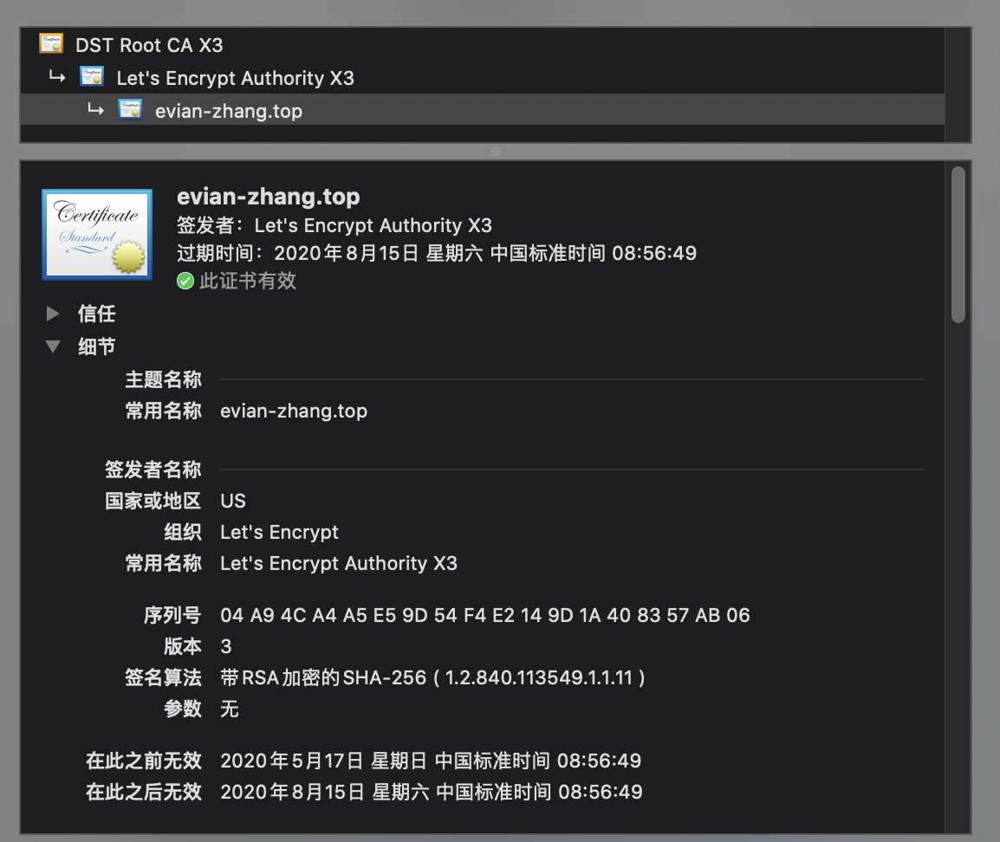

本系列文章以我的个人博客的搭建为线索（GitHub 仓库：[Evian-Zhang/evian-blog](https://github.com/Evian-Zhang/evian-blog)），记录我在现代化程序设计中的一些笔记。在这篇文章中，我将从数字签名与证书开始，逐一介绍Web端、iOS端和Android端App的可信安全机制。

# 不止于保密的三大问题

我们知道，在现代科技领域，安全与密码学紧密相关。如果我们需要保证一个产品的安全，那么一定会去求助于密码学的工具。那么，密码学解决的究竟是什么问题？

## 保密

最基本的，密码学是为了保密。Alice和Bob在大庭广众下通信，但仍然不希望他人知道他们俩谈的内容，那么密码学就帮助他们对通信的内容进行加密，达到这样的目的。

在保密这个领域，密码学有两个武器：对称加密与非对称加密。

对称加密就是Alice和Bob在通信之前，掌握一个相同的密钥K。Alice说话之前，把想说的话m用K进行加密，成密文c。Bob收到c以后，用相同的K进行解密，得到Alice想说的话m。这个想法是很自然的，也能做的十分安全。但是，这种方案要求Alice和Bob要提前获得共享的密钥K，如果没有可靠的，不会被他人监听的信道，又怎么能传输K呢？这时我们来看看非对称加密。

非对称加密就是Alice生成了一个公钥P，一个私钥S。Alice将自己的公钥P广播给所有人，然后用私钥S加密自己的消息m，得到密文c。Bob用Alice广播的P对c进行解密，得到Alice想说的明文m。也就是说，密码学家运用超群的智慧，想出了一些算法，保证由公钥P得不到私钥S，同时由私钥加密的消息能用公钥进行解密。这就是非对称加密。

看上去非对称加密完全不需要Alice和Bob事先通过安全的信道共享密钥，那为什么还需要对称密钥呢？这是因为，非对称加密的算法很复杂，加密、解密一次的时间太长，如果要实时加密通信，那么完全不能用非对称加密。总之就是，对称加密快，但是需要事先用安全信道传输密钥；非对称加密不需要安全信道，但是慢。

## 保密之外的三大问题

除了保密之外，密码学还能解决什么问题呢？现在密码学一般还需要负责另外三个问题：

* 真实性(Authenticity)
* 完整性(Integrity)
* 不可否认性(Non-repudiation)

Bob收到了Alice发的一条消息，那么真实性就是Bob需要确定这消息确实是Alice发的，完整性就是Bob需要确定Alice发的确实是这条消息，没有得到篡改，不可否认性就是如果Alice说这条消息不是他发的，那么Bob需要向第三方证明这条消息确实是Alice发的。

真实性和不可否认性看上去似乎差不多，其区别在于，Bob可能可以通过一些只有自己知道的信息确认这是Alice发的，比如说，Alice在消息中说，Bob生日是1919年8月10号，那么Bob知道只有Alice知道这个秘密，所以真实性得到了保证。但如果Alice否认了这个消息，Bob向法官说，只有Alice知道自己的生日是1919年8月10号，但法官说我怎么知道你生日真的是1919年8月10号，所以这就不能保证不可否认性。

为了解决真实性，我们最常见的做法就是双方共享密钥或使用公钥私钥。这是因为，对于共享密钥的情况，只有对方是拥有我们的密钥的，所以真实性可以保证；而对于公钥私钥的情况，则是因为只有用对方私钥加密的东西才能用我们的公钥解开，同样能保证通信者确实是对方。

而对于完整性，密码学家则提出了哈希函数的概念。用最简单的话来说，哈希函数就是，即使原文本只改变了一点点，得到的哈希值仍然会有巨大的变化。那么我们就只需要对比哈希值就能确认完整性。

密钥解决真实性，哈希值解决完整性，那么如果我们既需要真实性和完整性，该怎么办呢？

首先，我们要感谢密码学家，他们帮我们想到了一些精妙绝伦的算法，称为数字签名算法。非对称数字签名算法和非对称加密类似，也是Alice生成一个公钥P和私钥S，然后用S和这个算法对明文m做一些处理得到c。但是，非对称数字签名算法并不要求Bob用P能从c还原出m，而是根据m和P，判断这个c是不是用正确的私钥S加密的。这就像现实生活中的签名一样，能够判断这究竟是不是Alice说的。在这种情况下，通过私钥对明文进行数字签名后得到的c，一般称为消息验证码(MAC)。

通过数字签名算法，我们有效地解决了真实性和完整性。因为私钥只有Alice有，所以只要我们用Alice的公钥判断成功，那么这消息肯定是Alice发的。而数字签名算法又保证了，只要你稍微改动一点点原来的消息m，那么得到的MAC值则会产生巨大的改变。因此，我们也能顺利地判断完整性。

但是，不可否认性并不能解决。Alice否认了，我们拿着Alice的公钥去找法官，法官说，我怎么知道这就是Alice的公钥，说不定是你随便找的呢。因此，我们需要更近一层，使用数字签名证书。

Bob跟Alice说，如果你以后再发消息，首先，你要去找村口曹安，他童叟无欺，大家都信任他，让他给你的公钥打上标记，这样我再拿着你的公钥去找法官，法官见到曹安的标记，就会相信这个公钥是Alice的了。这就是数字签名证书的最核心的原理。

数字签名证书首先需要一个可信第三方，大家一般称他为CA(~~Cao An(划)~~Certificate Authority)。整体过程为：

1. CA自己产生一个公钥PA和一个私钥SA。
2. CA把PA分发给全村所有人，然后私钥自己保存好，一旦丢失就gg了。
3. Alice产生一个公钥P和一个私钥S
4. Alice把自己的相关信息写成一个证书，有自己的公钥P，自己的姓名Alice，还有一些其他信息，然后交给CA去签名。
5. CA用自己的私钥SA对这个证书签名。
6. 之后，Alice就爽了。他每次发消息给Bob的时候，一共提供三个东西：原文m，消息验证码c，CA签名的证书。

Bob一拿到Alice发的信息会干这些事：

1. 首先先拿CA之前发给自己的公钥PA，验证这个证书是不是CA签名的。
2. 如果证书是CA签名的话，从证书中获得Alice的公钥P。
3. 拿Alice的公钥P和原文m，消息验证码c，判断这个消息有没有通过数字签名验证算法。

我们之前说过，单纯的消息验证码就可以保证真实性和完整性，然后又由于CA大家都相信他，并且他的私钥不能被别人伪造，所以Alice无法否认这个消息确实是他发的。

当然，如果曹安是隔壁村的，但大家依然信任他，我们不能每个人都跑大老远去找他来签名自己的证书，曹安也会累。所以，我们就在我们村找个人叫陈昂（大家就叫他CA2），让他去找曹安签名自己的证书，得到CA2的证书。然后接下来我们村的人就不用找曹安来签名我们的证书了，直接找陈昂。当验证Alice证书的时候，我们首先根据获得的曹安的公钥，验证陈昂的证书确实是真的，再拿陈昂CA2证书里的公钥验证Alice的证书。也就是说，Alice发消息的时候，会发自己的原文m，消息验证码c，陈昂的证书，Alice的证书。这种过程可以一直延续下去，由根CA逐级签名，由曹安签陈昂的证书，陈昂签蔡艾的证书，一个接着一个，这就叫证书链。

有了这么强大的武器，我们接下来就用在实战中。

# HTTPS

首先我们来看Web应用的可信安全机制。我们在使用浏览器浏览Web App的时候，有哪些环节需要安全呢？

* 根据域名访问网页的时候，网页应是由我们请求的服务器发出，不应被第三方服务器假冒
* 获得的网页不应被第三方篡改
* 与服务器的通信不应被第三方窃取

根据我们之前讲的密码学工具，为了满足第一点，我们只需要让服务器同时发给我们他的证书，然后我们验证证书的真实性就能保证这个网页确实是由我们请求的服务器发出的。为了满足第二点，我们只需要在通信的过程中让服务器附带哈希值或MAC码。为了满足第三点，我们需要对通信内容进行加密。

前两点看上去都挺好办的，那么第三点该怎么办呢？加密通信有两种方法，对称加密和非对称加密。我们之前提到，非对称加密的效率很低，但是我们浏览网页自然需要网页加载快，那我们就得使用对称加密。但是对称加密又需要双方事先共享密钥，并且这个密钥必须在安全信道内传输，但我们并没有这个条件。怎么办呢？聪明的密码学家想到，我们可以用非对称加密对共享密钥进行加密，在通信之前，利用非对称加密获得对称加密的共享密钥，然后用共享密钥对通信的消息进行加密，这样就OK了。

上面的步骤落实到工业界，就是我们耳熟能详的TLS了。TLS是在TCP层之上的一个协议，干的事就是我们刚刚分析的行为，现在业界使用的最新的版本是TLS 1.3，它的标准可以在[IETF RFC8446](https://tools.ietf.org/html/rfc8446)中看到。

用最简化的模型，TLS的工作原理是：

* 事前准备
	* 服务器
		* 生成一对公钥-私钥
		* 把公钥和其它一些基础信息做成一个证书，交给CA签名
	* 浏览器端
		* 将所有可信CA的公钥存储在本地
* TLS连接建立
	1. 浏览器向服务器发出连接请求
	2. 服务器将自己的证书发送给浏览器
	3. 浏览器利用事先存储的CA公钥，验证证书的有效性
	4. 浏览器生成一个共享密钥K（用于之后的对称加密）
	5. 浏览器使用服务器证书中的服务器公钥P对共享密钥K进行加密
	6. 浏览器将加密后的共享密钥发送给服务器
	7. 服务器用私钥S对消息解密，得到共享密钥K
* TLS通信过程
	* 每次通信，通信双方使用共享密钥K对消息进行加密，并使用哈希值作完整性保证

看上去虽然很复杂，但是根据我们上面的讨论，证书用于真实性、不可否认性，共享密钥用于保密性，哈希值用于完整性，整个过程是很符合逻辑的。

说了这么多，那HTTPS又是什么呢？HTTPS实际上就是HTTP over TLS，用TLS来实现HTTP通信而已，并没有什么特殊之处，其核心仍然是TLS。

在实际的服务器建设中，HTTPS是默认使用443端口，但我们要注意一点，在配置服务器的时候，最好应该把80端口重定向到443端口，而不是直接关闭80端口。这是因为，当我们在浏览器上输入`evian-zhang.top`的时候，它默认是80端口，因此如果我们关闭了80端口，那么用户只有在输入`https://evian-zhang.top`的时候，才能正确访问，但这显然是不符合用户习惯的。

至于HTTPS的证书，有收费的也有免费的。对于个人博客网站而言，我选择的是[Let's Encrypt](https://letsencrypt.org)这个免费的证书申请。使用任何一个主流浏览器，都可以检查相关网站的证书。我的个人博客的证书用Safari浏览器查看如下：

可以看到，确实是Let's Encrypt签发的。

至于这些证书签发机构究竟是凭什么能给我签名，也就是证书签发机构是怎么保证这个服务器被我控制的呢？我们可以简单地理解成，比方说我希望能对`evian-zhang.top`这个域名进行验证，证书签发机构会要求在`evian-zhang.top/.well-known/abc.txt`这个路径下有相应的内容，那么如果它看到确实这个内容存在，那么毫无疑问这个域名是由我控制的服务器控制的。这就是一种典型的Challenge-Response的验证方法。

# Android签名机制

我们在使用Android App的时候，同样和Web App一样有一些安全需求：

* 下载、安装的App必须就是我们想要的App，不能被别人冒充
* 使用App的时候，与服务器通信的数据应加密

第二点可以很容易地用HTTPS完成，那第一点该怎么办呢？在Web中，我们可以让服务器提供由我们信任的CA签名的证书，来确保没有被冒充。而Android中，则更为宽松一些。

在[对应用进行签名](https://developer.android.google.cn/studio/publish/app-signing)这篇官方文档中，我们可以看到，所有Android App都必须先使用证书进行数字签名，然后才能安装到设备上或进行更新。这里的证书，不一定要由我们信任的根CA——也就是Google Play来签名，也就是说，这里主要的目的在于，保证这个App完全是由证书拥有者编写，没有得到篡改。

总的来说，Android App的证书签名分两类：

* 开发者自己负责的签名
* Google Play负责的签名

开发者自己负责的签名很直观，如下图所示：

开发者用本地的应用签名密钥对App进行签名，然后上传到Google Play或其它应用市场，然后用户下载并验证证书。

Google Play负责的签名的主要流程如下图：

1. 开发者用自己本地的上传密钥对App进行签名
2. 开发者将签名的App上传到Google Play
3. Google Play验证开发者的上传密钥
4. Google Play用Google内部保管的开发者的应用签名密钥对App进行签名

看上去Google Play负责的签名似乎特别麻烦，但实际上，这集中解决了一个问题：开发者弄丢密钥。如果我们采用第一种方法，开发者自己负责签名，那么如果开发者的密钥弄丢了，那么App将无法更新，只能重新下载。那么怎么解决这个问题呢？那直接把密钥存在Google内部，让Google帮我们签名就好了。但是，Google怎么知道用谁的密钥对App进行签名呢？我们只需要将本地的上传密钥的公钥交给Google，Google就可以根据我们用上传密钥签名的证书来验证这个App是不是我的，从而对我的App重新用应用签名密钥进行签名，这么解释出来还是比较简单的。

此外，还有一点就是，怎样签名，这在[应用签名](https://source.android.google.cn/security/apksigning)这篇官方指南中得到了解释。

Android App的签名一共分为三种：v1, v2和v3。

Android的v1签名是基于JAR的签名来做的，实际上和Android框架无关。采用这种签名方式之后，我们可以在APK包内的`META-INF`目录下找到两个文件，分别以`.SF`和`.RSA`作为扩展名。这两个一个是哈希值，一个是公钥。

Android的v2和v3签名则是对整个App进行签名，并且签名后的文件并不是直接放在APK的zip包内，而是附加在zip包后：

# iOS签名机制

Android的签名机制是怕开发者的App被篡改，但是iOS的App都是直接由App Store分发的，那是不是就不需要签名了呢？事实上，iOS上用App Store下载的应用确实是没有签名的。但是，iOS上的App都是由App Store分发的吗？

其实，还有一些其他的情况：

* 企业内部App
* 开发者自己小范围实机测试用的App
* 开发者大范围测试用的App

这些情况，都不是通过App Store进行分发的，那么，iOS是怎么保证这些应用的安全的呢？还有，App Store又是怎么确定是真实的开发者提交的App而不是冒充的呢？

所以，iOS得考虑这些事：

* 确保只能运行上述四种途径下载的App，其他途径的App不能运行
* App Store接收提交的App的来源应该是真实的

为了解决这些问题，仍然得靠签名和证书。

我们可以参考Web中TLS的实现原理，浏览器会内置根CA的公钥。那么，我们的iOS中可以内置Apple的公钥，然后只需要验证Apple私钥签名的证书就可以实现第一点了。也就是说：

1. 开发者本地生成一对公钥和私钥
2. 开发者将公钥提交给Apple
3. Apple用自己的私钥签名开发者公钥，生成一个证书，发送给开发者
4. 开发者用私钥签名App
5. 开发者将证书打包进App

然后，用户只需要先验证证书是否由Apple签名，再验证App是否由开发者签名，就可以完美解决这个问题了。同样地，App Store也可以对我们的证书进行验证，从而解决第二个问题。

接下来的问题和Android类似，怎么签名，或者说，签名什么。

Android的v1签名是只签名JAR，而之后的版本则是整个App签名。这是因为，一个App除了程序代码之外，还有权限等额外的信息。iOS App也是一样，所以，iOS中采用的是使用一个Provisioning Profile，将证书、权限等一切都放在一起，然后再由开发者签名，这样也完成了一样的事情。