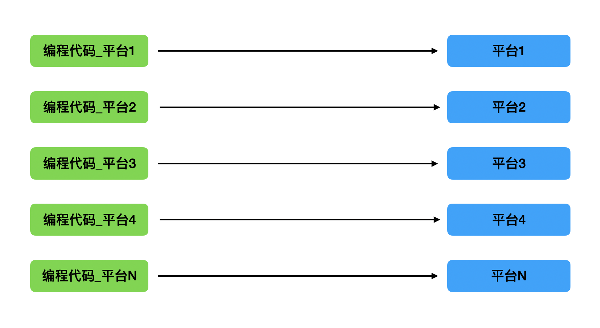
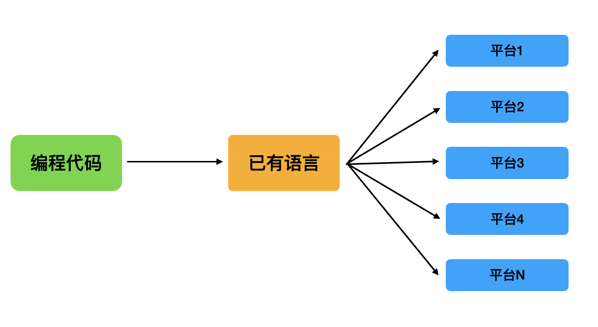

本系列文章以我的个人博客的搭建为线索（GitHub 仓库：[Evian-Zhang/evian-blog](https://github.com/Evian-Zhang/evian-blog)），记录我在现代化程序设计中的一些笔记。在本篇文章中，我想就编译方法作一些讨论。

# 运行平台简介

我们的计算机执行一个程序，其本质的过程如下：

1. 我们告诉操作系统，要执行某个程序
2. 操作系统查看该程序，并告诉CPU如何执行这个程序
3. CPU开始执行程序

在这个过程中，我们可以发现，影响一个程序执行的因素有两个：操作系统决定这个程序该如何执行，以及CPU根据程序执行相应的指令。

“操作系统决定这个程序该如何运行”究竟是指什么呢？以可执行文件`a.exe`为例，它实际上就是一串二进制数组成的序列。一个可执行文件实际上并不全是需要CPU执行的指令，也就是说，操作系统不会告诉CPU，直接从这串二进制串的第一个数位开始，一直执行到结束。相反，一个可执行程序是具有精妙的结构的。这是因为一个可执行程序除了可执行的代码，还有许多别的东西需要保存。比如说，C语言中的一个静态全局变量：

```c
static int a = 114514;
```

在大多数操作系统平台中，其并不会位于可执行文件的代码区，而是单独存储在一个数据区。通过这样的做法，可以让处于代码区的任何一个指令读取这个数据。当然，可执行文件内部分区的作用还有很多，这里就不再介绍了。

但是，可执行文件分区并没有一个统一的标准，Windows的PE文件结构，macOS的mach-O文件结构，Linux的elf文件结构等等，有各种各样对可执行文件的分区。因此，一个可执行文件只有在特定的操作系统中才能被正确执行，也就是说只有特定的操作系统，才能识别这个可执行文件到底应该让CPU执行哪一部分程序，而把哪一部分数据载入内存。

此外，除了特别简单的程序以外，大部分程序还必须链接操作系统提供的系统库。这是因为有许多必要的功能都是只有操作系统才能提供的，比如说打开文件、打开套接字等等功能。这些功能，不同的操作系统中有不同的实现。所以，链接了某个操作系统的系统库的程序也只能在相应的操作系统中运行。

至于CPU执行程序，也有其特殊性。就像刚刚说的，CPU执行的实际上是一串二进制数组成的序列。那么，它怎么知道这串二进制序列对应哪一个指令呢？这一过程也是没有统一标准的。因此，Intel的x86_64的CPU有一套二进制串对应指令的字典，AMD的CPU也有一套，PowerPC的CPU也有一套。那么，我们编写的可执行程序也必须有关于CPU的特异性，也就是说，能在某个CPU上运行的可执行程序，未必能使用另一种CPU运行。

根据上面的讨论，我们可以发现，如果我们的程序需要在m个操作系统的n个CPU上运行，那么总共需要产生mn种不同的可执行程序。因此，一个操作系统+一个CPU，就构成了程序运行的一个平台。

# 编译型语言与解释型语言

最早的开发者，就是纯手打CPU指令序列，或者其对应的汇编语言，来生成一个又一个可执行文件。那么，就像上面所说的，如果要适应m个操作系统的n个CPU，就要写mn种不同的程序，但它实现的功能却是相同的。这显然是一种非人的行径。它的开发方式如图所示



因此，人们就开始思考有什么解决方法。

## 编译型语言

最早的人想到的解决方法是，在汇编语言之上搞一套各平台语法统一的语言，然后由大佬程序员根据不同的平台写不同的编译器，将更高级的语言转录为不同平台的可执行程序。通过这样的设计，可以避免在开发每个程序的时候，都需要根据不同的平台写不一样的代码。而是根据开发者使用高级语言写一份代码，根据大佬写的编译器编译出各种版本。经过人们早期的尝试，最终以这种形式存活下来的语言就是C语言。它的开发方式如图所示：


随着时代的发展，出现了越来越多的编程语言。如果按照C语言的设计模式，每出现一个新的语言，都需要一个大佬帮它写多种不同平台的编译器，这样也会拖慢编程语言的发展。人们意识到，其实编译器也是一种可执行程序，那么，我们也可以从编译器内部考虑动一些手脚。

最聪明的一批开发者想到，我们可以将新的编程语言翻译成之前已经出现过的语言，再通过之前已有语言的编译器编译成符合各个平台的可执行文件。它的过程如图所示：



通过这种方案，只需要一个大佬写了各平台的编译器，别的编译器开发者只需要写新的编程语言到已有的编程语言的编译器即可。

那么，有哪些已有的低级语言拥有比较齐全且成熟的各平台支持呢？以目前来看，主要是C语言和LLVM字节码。C语言相比不用说了，因为出现得最早，且大多数操作系统都提供C语言的系统库，所以C语言的编译器的平台支持十分广泛。选择将自己编译成C语言以后，再通过不同的C编译器编译到不同平台的主流语言是[golang](https://golang.org)。而[LLVM](https://llvm.org)的字节码则是比C语言更低层的一种语言。通过将新的语言编译成LLVM字节码，可以达到C语言达不到的某些优化程度。选择编译到LLVM的语言有[swift](https://swift.org)和[Rust](https://www.rust-lang.org)等。现在不仅新出的语言会选择编译成C或LLVM字节码，新出的CPU、操作系统等，也会自己提供C语言的编译器或者LLVM的编译器。

此外，我们还可以注意到一个有趣的事：当我们的新的编程语言进行了一些改动，变成了1.01版本的时候，1.00版本的语言也就成了已有的语言。那么，我们是不是可以使用之前1.00版本的语言作为新的1.01版本的语言的翻译目标呢？或者说，直接用1.00版本的语言作为1.01版本语言的编译器的使用语言呢？虽然这不是必要的操作，但许多编程语言都实现了这一功能，并把它叫做「自举」。刚才提到的go语言以及Rust语言等，实际上都实现了自举。

总的来说，这一小节叙述的语言的特点是，开发者通过语言的编译器，将自己编写的代码转化为不同平台的可执行程序。这些语言被称为编译型语言。

## 解释型语言

解释型语言是与编译型语言不同的另一类语言。编译型语言正如刚刚所说，它的编译器实际上是一个字符串向二进制序列的映射，它将代码字符串通过某些操作映射到CPU需要执行的二进制序列上。解释型语言则不一样，它更加自主，它接收代码字符串，不返回任何东西，而是自己来执行。

打个比方来说，这就像是你如果想去一个语言不通的国家，找了个翻译。对于编译型语言，它要求你把你想说的话写成一张纸，交给翻译，翻译帮你翻译成该国的语言，然后你拿着翻译的纸去给当地人看；对于解释型语言来说，就是你把翻译带在你身边，你说一句，翻译就向当地人翻译一句。

再举一个例子来说，我如果发明了一种新的语言IDIOT，如果代码为`TRUMP`, 那么需要系统打印字符串"No one knows better than me". 那么，如果要按照刚刚讨论的，做一个将IDIOT语言翻译成C语言再编译成平台相关可执行文件的编译型语言的编译器，那么我可以用C语言这样写：

```c
char *translator(char *input) {
    if (input == "TRUMP") {
        return "printf(\"No one knows better than me\");";
    }
}
```

而解释型语言就不一样了，如果要实现我刚刚说的需求，用C语言实现的解释器应该这样写：

```c
void interpreter(char *input) {
    if (input == "TRUMP") {
        printf("No one knows better than me");
    }
}
```

解释型语言也有其缺点，就是代码分发的过程。对于编译型语言，程序员只需要将同一份代码根据不同的平台编译成不同的可执行文件，然后把可执行文件发给用户，用户可以直接使用；但是对于解释型语言来说，程序员在将代码发给用户的时候，还需要把代码的解释器也一并发送给用户，用户需要使用解释器才能对代码进行解释。

解释型语言也有很多，比如说著名的JavaScript就是解释型语言。

而编译型语言中我们提到，有些编译器是将新的语言编译成已有语言，再调用已有语言的编译器。这个过程中涉及到两个转换：新的语言到已有语言的转换，已有语言执行的转换。在编译型语言中，已有语言也是编译型语言，所以已有语言会编译成可执行文件进行执行。而我们能不能用解释型语言替换这一步骤呢？也就是说，将新的语言编译成已有的解释型语言，然后用解释器去执行解释型语言。这一方法显然是可行的，使用这一方法的最著名的语言就是Java了。事实上，所有编译到JVM字节码的语言，比如说Kotlin的JVM版本等，都是采用这种模式。

我们换个角度来看这个问题，对CPU执行机器指令这个事情而言，CPU是编译器还是解释器呢？毫无疑问，CPU对于接收到的指令，并不会把它输出为别的语言，而是直接执行，所以CPU从外部来看就是一个解释器，它解释的是机器指令。那么假设我们不知道CPU的存在，对于JVM类型的语言来说，它们的代码首先会被编译为JVM字节码，然后由JVM来执行。那么，JVM字节码就像是机器指令一样，而JVM的执行器就像是一个CPU，JVM本身就像是有了内存和CPU的计算机一样。因此，我们也常称JVM类的语言为在虚拟机上的语言。

# 编译技巧

现代的任何编程语言，都无外乎刚才讲的几种编译类型。随着代码规模的增加，和对程序性能需求的提高，编译的过程中也会有一些现代化的技巧，本节主要就几个常见技巧作介绍。

## 增量编译

对于编译型语言来说，从开发者写代码到客户运行的过程是，开发者写好了代码，编译器将开发者的代码转录成机器能识别的可执行程序，然后分发给用户，用户运行可执行程序。在这个过程中，涉及到了两个耗时的环节，一个是编译器将源代码编译成目标代码的过程，一个是用户执行可执行程序的过程。用户执行可执行程序时的运行时间，可以通过各种优化技巧进行优化，那么编译时间如何缩短呢？开发者常常会遇到一种情况，一个项目的程序十分大，而自己需要在某个文件的某一行改一个bug，然后重新编译，编译器又需要把整个项目的代码都读进去，然后再对绝大部分的代码执行之前已经执行过的编译过程，只有在开发者改的那一小部分才会做新的编译。

只要解释清了导致这一现象的原因，相信大家都会知道该怎样节约编译时间了，那就是只编译改动部分的代码，这就叫做增量编译。但是，这说来简单，但实际做起来也有一定的困难。下面我以Rust编译器的增量编译过程为例，介绍常见的增量编译技巧，参考文章为Rust的[这篇博客](https://blog.rust-lang.org/2016/09/08/incremental.html)。


Rust一个普通的编译过程如上图所示，首先编译器将源代码进行语法分析，然后形成抽象语法树AST。接着通过一些高端技巧进行分析，得到类型信息和MIR。然后优化并得到目标文件，最终由链接器进行链接，得到可执行文件。


为了实现增量编译，Rust做的则是通过构建一个依赖图，将每一个部分都与前一环节的部分形成依赖关系。也就是说，通过依赖图，我们就可以知道，更改前一环节的某些部分，会影响后一环节的哪些部分。


根据这一原理，当开发者修改了一小部分代码的时候，Rust编译器根据依赖图得到了每一环节需要更改的部分，对于不需要更改的部分，则直接使用之前编译的结果。这就是增量编译的过程。

## JIT与AOT

对于解释型语言来说，从开发者编写代码到用户运行的过程是，开发者编写代码，将代码和解释器分发给用户，用户使用解释器解释代码，解释器一行一行地阅读代码，并执行代码。

这个看似没有问题，但我们考虑一个情况，对于下述JavaScript代码：

```javascript
function trump() {
    console.log("No one knows better than me");
}

for (let i = 0; i < 3; i += 1) {
    trump();
}
```

如果采用最原始的解释器来解释它，解释器会怎么做呢？首先，初始化一个变量`i`为`0`, 然后去解释`trump`这个函数，然后进行`i < 3`的判断，如果为真，则再次执行循环体，再次解释`trump`这个函数。

与直接执行机器代码不同，解释器在解释语句的时候，首先需要将语句进行语法分析，也就是把字符串转化为内存中的抽象语法树，然后再执行。这一过程实际上是十分耗费时间的。想象一下，我们一般将功能抽取为函数，常常因为这个功能的代码比较多，而且调用次数也多。那么对于解释器来说，就要重复多次解释一个之前已经解释过的代码，并且如果代码很长，这一过程会造成时间的大量浪费。

通过上述的描述，相信大家一定想出了解决这个问题的方法，那就是在第一次解释的时候，就把这个函数解释的结果存储下来，下次再执行的时候，就少了语法分析这一步，直接执行之前解释的结果就行了。这就是JIT的作用，也就是将部分代码在执行的时候编译成宿主平台的原生代码运行。当然，这里面也有许多技巧，比如说将哪一部分的代码进行JIT编译等等。

而AOT则是直接在运行之前就将代码编译为宿主平台的原生代码，类似于我们传统意义上的编译型语言。

最常见的使用JIT和AOT技术的，就是在JVM上，尤其是在Android平台定制的JVM上。我们可以在[这篇指南](https://source.android.google.cn/devices/tech/dalvik/jit-compiler?hl=zh-cn)上了解Android平台的JIT以及AOT举措。