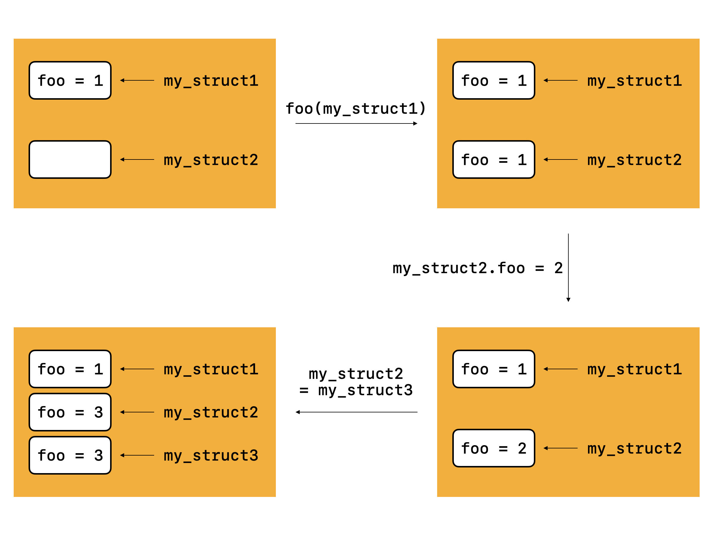
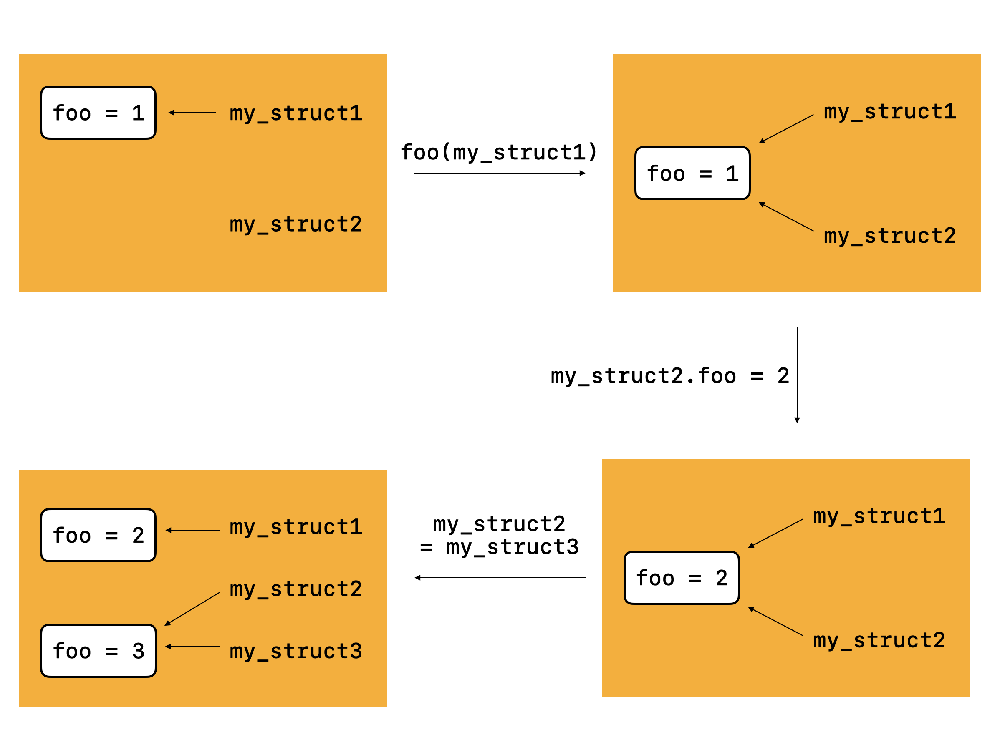
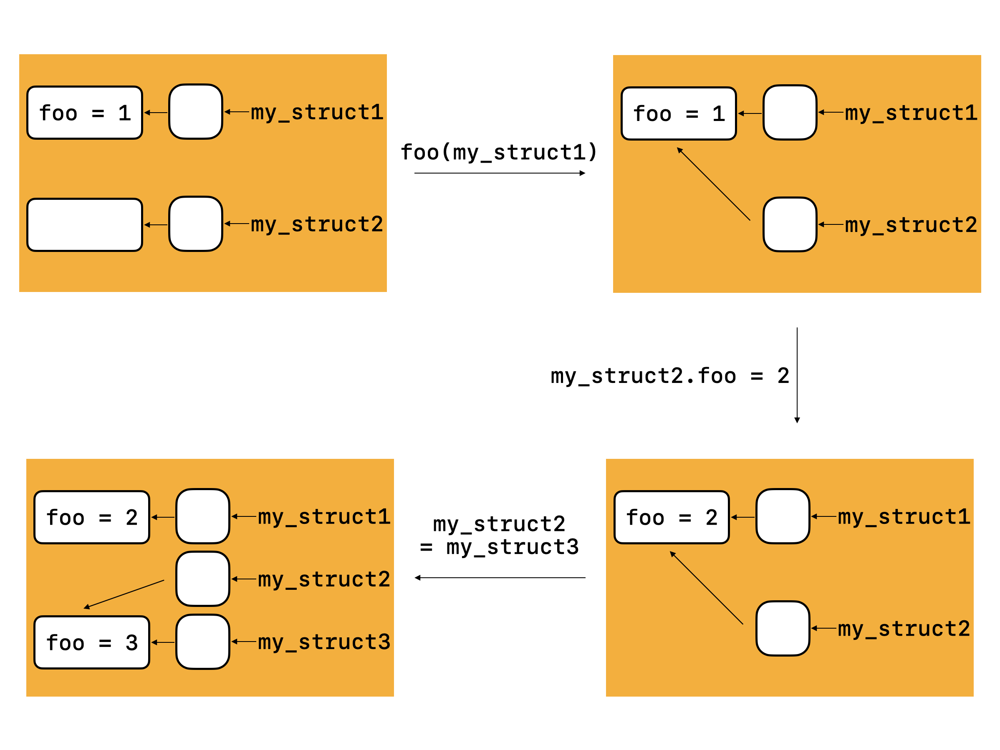
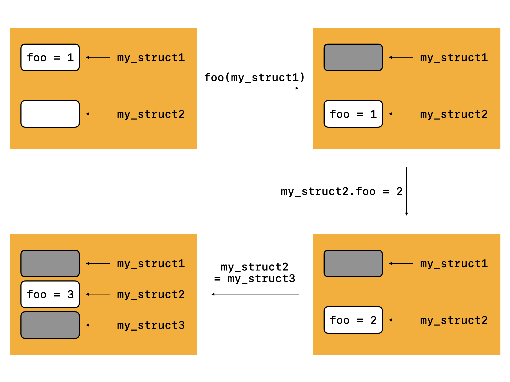

本系列文章以我的个人博客的搭建为线索（GitHub 仓库：[Evian-Zhang/evian-blog](https://github.com/Evian-Zhang/evian-blog)），记录我在现代化程序设计中的一些笔记。在这篇文章中，我将讨论的是现代语言的各种赋值语义。

# 背景

无论我们使用什么语言进行编程开发，都会遇到一个基本的问题，比如说以C++为例：

```c++
struct MyStruct {
	int foo;  
};

void foo() {
    MyStruct my_struct1, my_struct2;
    mystruct1.foo = 1;
    my_struct2 = my_struct1; // [1]
    my_struct2.foo = 2; // [2]
    MyStruct my_struct3 = (MyStruct){ .foo = 3 };
    my_struct2 = my_struct3; // [3]
}
```

关于赋值的语义，它研究的问题很简单，就是在步骤[1]的赋值之后：

* 经过步骤[2]，`mystruct1`的`foo`字段会不会改变
* 经过步骤[3]，`mystruct1`的`foo`字段会不会改变

这个话题在英语中一般不是semantic of assignment, 而是semantic of parameter passing, 也就是在调用函数进行参数传递时的语义，但实际上和我们说的赋值语义基本上是一个意思，用参数传递的思想改写上面的例子就是

```c++
struct MyStruct {
	int foo;  
};

void bar(MyStruct my_struct2) {
    my_struct2.foo = 2; // [2]
    MyStruct my_struct3 = (MyStruct){ .foo = 3 };
    my_struct2 = my_struct3; // [3]
}

void foo() {
    MyStruct my_struct1;
    mystruct1.foo = 1;
    bar(my_struct1); // [1]
}
```

虽然第一个例子是在赋值中的语义，第二个例子是在参数传递，实际上是初始化时的语义，但一般的语言对这两种语义也就是一个构造函数和一个赋值运算符重载的区别，而大部分实现中这两者是相同的。但事实上，使用参数传递的例子能够更方便地说明一些情况，所以本文就使用第二个例子来说明。

# 赋值语义分类

常见的赋值语义有三种：用值语义传递、用引用语义传递以及用移动传递。

使用我们之前讲的那两个判断依据来说的话，这三种赋值语义的区别在于：

* 值语义
    * 经过步骤[2]，`mystruct1`的`foo`字段不会改变
    * 经过步骤[3]，`mystruct1`的`foo`字段不会改变
* 引用语义
    * 经过步骤[2]，`mystruct1`的`foo`字段会改变
    * 经过步骤[3]，`mystruct1`的`foo`字段不会改变
* 移动语义
    * 经过步骤[2]，`mystruct1`的`foo`字段无意义
    * 经过步骤[3]，`mystruct1`的`foo`字段无意义

# 赋值语义的实现

根据上面的结论，似乎步骤[2]和步骤[3]有很大的区别。那么首先，我们就要先搞清楚步骤[2]和[3]的区别。

我们知道，对于一个变量来说，它实际上就是存储在内存中特定位置的一块区域。决定一个变量的有两点：它的地址以及它的值。它的地址就是指内存中的那个特定的位置，而它的值就是指在那个特定位置的那块区域里的值。步骤[2]的意思是不改变这个变量`my_struct2`的地址，而是改变其值的一部分；而步骤[3]则是再次调用赋值语句，两次赋值语句叠加会产生特殊的效果。

## 值语义

就像我们刚刚说的，任何一个变量都有它的地址和它的值。而值语义是如何实现的呢？很简单，将值拷贝，而不拷贝地址。如图所示：



由于是传值，所以`my_struct1`的地址没有变，因此在步骤[2]中，修改的是`my_struct2`区域的值，`my_struct1`区域的值完全没变；在步骤[3]中，再次调用了赋值语句，此时依然按照传值语义，所以`my_struct2`的地址没变，依然只是改变了值，所以`my_struct1`的值也没变。

在大多数编程语言中，基本类型、`struct`类型的变量的赋值都是默认以值语义传递，比如Swift等。

## 引用语义

引用语义则与值语义不同，而且也是在实际开发中常用的方案。试想，我们如果想用一个函数对传入的参数进行一些修改，那么通过引用语义就可以很方便地进行了。

从效果上来看，引用语义如下图所示：



在引用语义中，赋值被看作给变量取别名。通过`foo(my_struct1)`，这块内存区域同时拥有了`my_struct1`和`my_struct2`这两个别名，因而通过步骤[2]对`my_struct2`的`foo`字段进行改变时，`my_struct1`的`foo`字段也随之改变。之后，由于`my_struct2`又被赋值为`my_struct3`，所以原先的那块内存区域又只有了一个名字`my_struct1`了，因而`my_struct1`的`foo`字段不会改变。

在编程语言实际实现时，往往是使用的指针的值语义来模拟引用语义。我们知道，指针也是一个变量，它也有自己的地址，而它的值则是另一块内存区域的地址。在指针语义中，所有变量都被看作是指向它所在区域的一个指针，赋值就是将这个指针变量按值语义赋值，如下图所示：



如果不看其实际内存区域，而是只看指针的话，按指针传递依然是一种值语义，只不过它的值是地址。

在Java，Kotlin，Swift中，`class`类型的变量都是以引用语义传递，也就是说，它们在赋值时不需要显式写出传递的变量是指针，而是隐式默认为指针。

此外，还有一种情况，如果开发者希望经过步骤[3]之后，`my_struct1`的值发生改变，这该怎么办呢？可以同时具有引用语义和值语义的语言可以直接用引用语义传入函数：

```c++
void pass_by_inout(MyStruct &my_struct) {
    my_struct = (MyStruct){ .foo = 3 };
}
```

然后通过值语义来赋值。

而不能同时有引用语义和值语义的语言，如Swift，则使用了特殊的语言加持：

```swift
func passByInout(_ my_struct: inout MyStruct) {
    my_struct = MyStruct()
}
```

在语言层面对这个特殊的用法进行了保护。

如果语言也没有对这个需求进行满足，比如说Python，那么我们作为开发者，就使用一些特殊的技巧：

```python
def pass_by_inout(my_struct):
    return MyStruct()

my_struct = pass_by_inout(my_struct)
```

通过这种方式也可以达到需求。

## 移动语义

移动语义则是在C++ 11之后提出的一种思想，也在Rust中得到了实现。在之前变量生命周期的文章中我提到，变量除了地址、值之外，我们还应该看到的是它的所有权。不管是按值传递还是按引用传递，实际上所有权都没有发生变更，但是，使用移动语义的赋值则是另一种思路了，比如说在C++中：

```c++
struct MyStruct { };

void bar1(MyStruct my_struct2) { }
void bar2(MyStruct &my_struct3) { }
void bar3(MyStruct &&my_struct4) { }

void foo() {
    MyStruct my_struct1;
    bar1(my_struct1);
    bar2(my_struct1);
    bar3(std::move(my_struct1);
}
```

`bar1`和`bar2`分别是采用值语义和引用语义的传参。那么无论是哪一种，都是在`foo`结束时，`my_struct1`被操作系统的栈直接释放。而`bar3`则通过右值引用，将`my_struct1`移动到了`bar3`中，在这之后，`my_struct1`就不应该再被使用，而其释放的权利交给了`bar3`的栈。在Rust中，似乎是使用`memcpy`来实现的移动语义，并使用编译器来约束检查。

从概念上来看，移动语义的操作如下图所示



当移动发生时，被移动的变量就不应再被使用了，而其完全变成了`my_struct2`。在`my_struct2`被`my_struct3`赋值了之后，`my_struct3`也就没有意义了。

